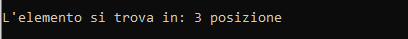

# Recursive sequential search

Implementazione ricorsiva dell'algoritmo di ricerca sequenziale di uno specifico
elemento all'interno di un vettore.

## Componenti della ricorsione
1. **Condizioni di terminazione:** `if(n <= 0)` - `if(v[n-1] == elemento_ricercato)`
2. **Istruzione di terminazione:** `return -1` - `return n-1`
3. **Passo di avvicinamento:** `n--`
4. **Chiamata ricorsiva:** `return ricerca_seq(v, n, ele)`

## Utilizzo
1. Crea in Code::Blocks un nuovo progetto.
2. Copia il codice sorgente.
3. Compila ed esegui.

## Codice sorgente
```cpp
#include <iostream>

int ricerca_seq(int v[], int n, int ele);

int main()
{
    int lung_vett = 20;
    int vett[lung_vett] = {2,5,15,3,12,19,4,20,13,7,11,9,24,36,22,31,29,18,25,31};
    int elemento_ricercato = 15;
    int posizione;

    std::cout << std::endl;
    if((posizione = ricerca_seq(vett, lung_vett, elemento_ricercato)) < 0){
        std::cout << "L'elemento non e' presente nel vettore.";
        std::cout << std::endl;
    }else{
        std::cout << "L'elemento si trova in: " << posizione + 1 << " posizione";
        std::cout << std::endl;
    }

    return 0;
}

// la funzione ritorna:
// > -1: l'indice del elemento cercato.
// -1: se l'elemento non viene trovato.
int ricerca_seq(int v[], int n, int ele){
    if(n <= 0)                      // caso base / condizione di terminazione
        return -1;                  // istruzione di terminazione

    if(v[n-1] == ele)               // caso base / condizione di terminazione
        return n - 1;               // istruzione di terminazione

    n--;                            // passo di avvicinamento (esplicito)
    return ricerca_seq(v, n, ele);  // chiamata ricorsiva
}
```

## Output


## Autore
Gabriele Henriet - [GitHub](https://github.com/Gabri-dev-C)

## Licenza
MIT License
